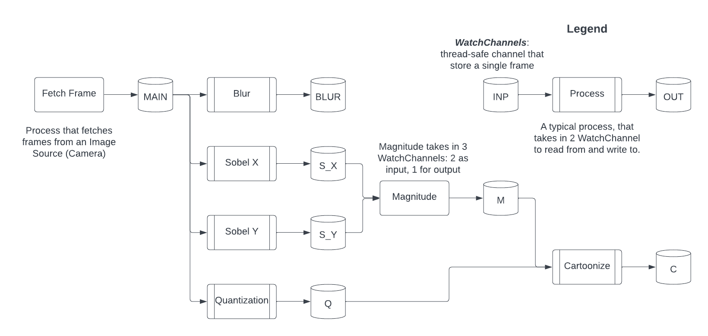

## FiltersCPP
FiltersCPP is a collection of filters implemented in C++, using [OpenCV](https://opencv.org/). It uses CMake to build, OpenMP to parallelize, and can compute the frame-time and fps for each filter.

### Filters
1. Blur
2. Negative
3. Sobel X and Y (Edge Detection)
4. Magnitude (Edge Detection) using Sobel X and Y
5. Quantization (Limit Colors)
6. Cartoon (Combination of Blur, Quantization and Magnitude)

### Features
- Uses CMake to build
- Can compute the frame-time and fps for each filter
- Multithreaded
  - Uses OpenMP to parallelize the filters
  - All filters operate in separate threads
    - Filters that depend on other filters, use the output of the previous filter using WatchChannels 
- Uses OpenCV to read and display from cv::VideoCapture

### Architecture
- Filters are implemented as classes that inherit from the Task class. 
- The Task class holds the thread the process(filter) runs on, the input and output channels.
- Each process uses a Processor class, 
  - that contains logic to compute frame-time and fps, for each frame.
  - holds a pointer to the function that is used to process the frame (Filters).

